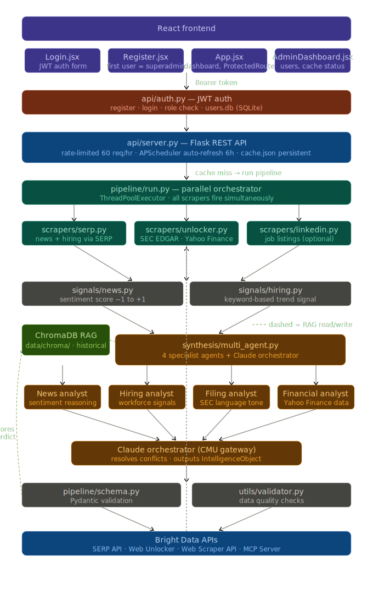

# MarketPulse AI — Architecture Reference

> Complete technical reference for the MarketPulse AI system.  
> Covers every layer, every file, the data flow, and the six production upgrades.



---

## Table of contents

1. [System overview](#1-system-overview)
2. [Four-layer architecture](#2-four-layer-architecture)
3. [Data flow — request lifecycle](#3-data-flow--request-lifecycle)
4. [Component reference](#4-component-reference)
5. [Authentication system](#5-authentication-system)
6. [Production upgrades (A4–A9)](#6-production-upgrades-a4a9)
7. [Multi-agent synthesis (A7)](#7-multi-agent-synthesis-a7)
8. [Extension points](#8-extension-points)
9. [Environment variables](#9-environment-variables)
10. [Running locally](#10-running-locally)

---

## 1. System overview

```
┌─────────────────────────────────────────────────────────────────┐
│  BROWSER  http://localhost:5173                                  │
│  React + Vite · Login/Register · Dashboard · Admin              │
└──────────────────────────┬──────────────────────────────────────┘
                           │  JWT-authenticated HTTP
                           ▼
┌─────────────────────────────────────────────────────────────────┐
│  API LAYER  http://localhost:5000                                │
│  Flask REST · 6 endpoints · JWT auth · APScheduler              │
│  Persistent JSON cache (A5) · Rate limiting (A9)                │
└──────────────────────────┬──────────────────────────────────────┘
                           │  run_pipeline(ticker, company)
                           ▼
┌─────────────────────────────────────────────────────────────────┐
│  PIPELINE ORCHESTRATOR  pipeline/run.py                         │
│  Parallel fetch (A8) → signals → multi-agent synthesis (A7)     │
│  ChromaDB RAG retrieval (A6) → validation → cache               │
└────────┬───────────────┬────────────────────────────────────────┘
         │               │
         ▼               ▼
┌──────────────┐  ┌──────────────────────────────────────────────┐
│   SCRAPERS   │  │  SIGNALS + SYNTHESIS                         │
│  serp.py     │  │  signals/news.py     → NewsSentimentSignal   │
│  unlocker.py │  │  signals/hiring.py   → HiringTrendSignal     │
│  linkedin.py │  │  synthesis/agent.py  → single agent          │
└──────┬───────┘  │  synthesis/multi_agent.py → 4 specialists    │
       │          │                           + orchestrator      │
       ▼          └──────────────────────────────────────────────┘
┌─────────────────────────────────────────────────────────────────┐
│  EXTERNAL SERVICES                                              │
│  Bright Data SERP API  ·  SEC EDGAR (direct)  ·  yfinance      │
│  CMU AI Gateway → Claude (OpenAI-compatible)                    │
│  ChromaDB (in-process vector store)                             │
└─────────────────────────────────────────────────────────────────┘
```

---

## 2. Four-layer architecture

### Layer 1 — Scrapers
**Location:** `backend/pipeline/scrapers/`  
**Responsibility:** Fetch raw data from external sources. Return unprocessed records. No knowledge of signals or intelligence objects.

| File | Source | Method |
|------|--------|--------|
| `serp.py` | Google News (news + hiring) | Bright Data SERP zone proxy → JSON |
| `unlocker.py` | SEC EDGAR + Yahoo Finance | SEC direct HTTP · yfinance library |
| `linkedin.py` | LinkedIn (fallback) | Bright Data Web Scraper API (paywalled — hiring uses SERP instead) |

### Layer 2 — Signals
**Location:** `backend/pipeline/signals/`  
**Responsibility:** Convert raw scraper output into typed, scored signal objects. Pure domain logic — no API calls.

| File | Input | Output |
|------|-------|--------|
| `news.py` | List of articles | `NewsSentimentSignal(score, label, articles_analyzed, top_headlines)` |
| `hiring.py` | List of hiring articles | `HiringTrendSignal(jobs_30d, signal, data_available)` |

Two signal types remain stubbed (always NEUTRAL) pending Day 3 implementation:
- `FilingLanguageSignal` — SEC text analysis
- `PricingSignal` — competitor pricing delta

### Layer 3 — Synthesis
**Location:** `backend/pipeline/synthesis/`  
**Responsibility:** Claude agent. Receives all four signal objects, reasons across them, returns a confidence score + composite signal + key risks + recommended action.

| File | Description |
|------|-------------|
| `agent.py` | Single-agent synthesis with ChromaDB RAG retrieval |
| `multi_agent.py` | 4 specialist agents (news, hiring, filing, financial) + orchestrator |

### Layer 4 — API + Frontend
**Location:** `backend/api/` · `frontend/src/`  
**Responsibility:** Serve intelligence objects via REST API. JWT-authenticated. React dashboard with routing.

---

## 3. Data flow — request lifecycle

```
1. User types "NVDA" in SearchBar → clicks Add
   frontend/src/App.jsx: apiFetch("/api/intelligence/NVDA?company=NVIDIA")
   Header: Authorization: Bearer <jwt_token>

2. Flask receives GET /api/intelligence/NVDA
   api/server.py: @jwt_required() validates token
   _CACHE.get("NVDA") → not found or stale → trigger pipeline

3. run_pipeline("NVDA", "NVIDIA Corporation") called
   pipeline/run.py: timestamp recorded, logging begins

4. Parallel fetch (A8) — all 4 sources fire simultaneously:
   ├── fetch_hiring_via_serp("NVIDIA")     → SERP API → 10 hiring articles
   ├── fetch_ticker_news("NVDA", ...)      → SERP API → 10 news articles
   ├── fetch_sec_filing_text("NVDA")       → SEC EDGAR direct → ~2600 chars
   └── fetch_yahoo_finance("NVDA")         → yfinance → 11 financial metrics

5. Signal analysis:
   ├── analyse_hiring_from_news(hiring_articles) → HiringTrendSignal
   └── analyse_news(articles, company)           → NewsSentimentSignal

6. ChromaDB retrieval (A6):
   _retrieve_context("NVDA", "earnings signals hiring news")
   → returns previous intelligence summaries for NVDA (if any)

7. Multi-agent synthesis (A7) — 4 specialists run in parallel:
   ├── news_agent    → {"signal":"BULLISH","confidence":72,"key_finding":"..."}
   ├── hiring_agent  → {"signal":"NEUTRAL","confidence":45,"key_finding":"..."}
   ├── filing_agent  → {"signal":"NEUTRAL","confidence":30,"key_finding":"..."}
   └── financial_agent → {"signal":"BULLISH","confidence":68,"key_finding":"..."}
   orchestrator synthesises 4 reports → final assessment JSON

8. IntelligenceObject built + Pydantic-validated

9. Result stored in ChromaDB (A6) for future context

10. _CACHE["NVDA"] = obj; _save_cache() writes cache.json (A5)

11. obj.to_api_dict() returned as JSON

12. React receives JSON → CompanyCard renders:
    BULLISH badge · confidence bar · 4 signal rows · key risks · recommended action
```

---

## 4. Component reference

### Backend files

| File | Responsibility | Touch when... |
|------|---------------|---------------|
| `config.py` | All env vars, proxy URL construction, validate() | Adding a new API or credential |
| `pipeline/schema.py` | Pydantic models for all data structures | Adding a new signal type or output field |
| `pipeline/run.py` | Orchestrator — coordinates all pipeline steps | Changing pipeline sequence or adding a data source |
| `pipeline/scrapers/serp.py` | Google News via SERP zone proxy, returns JSON | Changing search queries or adjusting time filters |
| `pipeline/scrapers/unlocker.py` | SEC EDGAR (direct) + Yahoo Finance (yfinance) | Adding new financial data sources |
| `pipeline/signals/news.py` | Keyword-based sentiment scoring | Tuning BULLISH_WORDS / BEARISH_WORDS |
| `pipeline/signals/hiring.py` | Hiring signal from news articles | Tuning hiring keyword balance |
| `pipeline/synthesis/agent.py` | Single-agent Claude call + ChromaDB RAG | Changing output schema or reasoning prompt |
| `pipeline/synthesis/multi_agent.py` | 4 specialists + orchestrator in parallel | Tuning specialist prompts or adding a 5th signal |
| `api/server.py` | Flask endpoints, APScheduler, persistent cache | Adding endpoints, changing cache TTL |
| `api/auth.py` | JWT auth, SQLite user management, admin routes | Changing auth logic or adding user fields |
| `utils/logger.py` | Dual console+file logging with immediate flush | Changing log format or adding log destinations |
| `utils/validator.py` | Data quality checks on completed objects | Adding new quality rules |

### Frontend files

| File | Responsibility |
|------|---------------|
| `src/main.jsx` | Root — BrowserRouter + AuthProvider + App |
| `src/App.jsx` | Route definitions + Dashboard component |
| `src/context/AuthContext.jsx` | Global auth state (token, user, role) |
| `src/api/client.js` | Centralized fetch with JWT header injection + 401 redirect |
| `src/components/ProtectedRoute.jsx` | Redirects unauthenticated / non-admin users |
| `src/components/CompanyCard.jsx` | Main intelligence card UI element |
| `src/components/SearchBar.jsx` | Ticker search + add to watchlist |
| `src/pages/Login.jsx` | Login form |
| `src/pages/Register.jsx` | Registration form (first = superadmin) |
| `src/pages/AdminDashboard.jsx` | User management + system health |

---

## 5. Authentication system

### How it works

```
Register (POST /api/auth/register)
  → First user: role = "admin"
  → All others: role = "user"
  → Returns JWT token

Login (POST /api/auth/login)
  → Validates email + bcrypt password hash
  → Returns JWT token + role

All intelligence endpoints: @jwt_required()
  → Validates Bearer token in Authorization header
  → 401 → frontend clears localStorage + redirects to /login
```

### User storage

SQLite database at `backend/data/users.db`:

```sql
CREATE TABLE users (
    id            TEXT PRIMARY KEY,
    email         TEXT UNIQUE NOT NULL,
    password_hash TEXT NOT NULL,
    name          TEXT,
    role          TEXT NOT NULL DEFAULT 'user',  -- 'user' | 'admin'
    created_at    TEXT NOT NULL,
    last_login    TEXT
);
```

### Admin capabilities

- `GET /api/admin/users` — list all users
- `PATCH /api/admin/users/<id>/role` — promote/demote
- `DELETE /api/admin/users/<id>` — remove user
- Admin dashboard at `/admin` — user table + system health + live cache

### Security note

Tokens are stored in localStorage for the demo. Production deployment should migrate to httpOnly cookies to prevent XSS token theft.

---

## 6. Production upgrades (A4–A9)

### A4 — APScheduler (real-time scheduling)
`api/server.py`  
Every 6 hours, stale cache entries are automatically refreshed in a background thread. The scheduler starts on server boot and shuts down cleanly on exit.

### A5 — Persistent JSON cache
`api/server.py`  
`backend/logs/cache.json` is written after every pipeline run and loaded on server startup. The cache survives restarts — the 5 seed companies are available instantly after restart without re-running the pipeline.

### A6 — ChromaDB vector memory (RAG)
`pipeline/synthesis/agent.py` · `pipeline/run.py`  
ChromaDB runs in-process (`backend/data/chroma/`). After each pipeline run, the intelligence verdict is stored as a natural-language summary. On subsequent runs for the same company, the 3 most relevant historical summaries are retrieved and appended to the synthesis prompt — enabling trend detection across runs.

### A7 — Multi-agent architecture
`pipeline/synthesis/multi_agent.py`  
Four specialist agents run in parallel via `ThreadPoolExecutor`:
- **news_agent** — sentiment and key events from headlines
- **hiring_agent** — hiring activity assessment
- **filing_agent** — SEC language and guidance tone
- **financial_agent** — Yahoo Finance metrics interpretation

An orchestrator agent synthesises the four reports into the final verdict. Falls back to single-agent if orchestration fails.

### A8 — Parallel fetching
`pipeline/run.py` · `scripts/run_pipeline.py`  
All 4 data sources (SERP news, SERP hiring, SEC EDGAR, Yahoo Finance) fire simultaneously using `ThreadPoolExecutor`. The batch script also runs all 5 companies in parallel rather than sequentially.

### A9 — Rate limiting
`api/server.py`  
Flask-Limiter caps requests per IP: 300/day, 60/hour default. Protects Bright Data credit budget from runaway clients.

---

## 7. Multi-agent synthesis (A7)

```
signals (Signals object)
    │
    ├── news_agent ──────────────────┐
    │   prompt: "financial news      │
    │   sentiment analyst"           │
    │   input: headlines + score     │  ThreadPoolExecutor
    │                                │  (all 4 run in parallel)
    ├── hiring_agent ────────────────┤
    │   prompt: "labour market       │
    │   intelligence analyst"        │
    │   input: articles + signal     │
    │                                │
    ├── filing_agent ────────────────┤
    │   prompt: "SEC filing          │
    │   analyst"                     │
    │   input: filing text + tone    │
    │                                │
    └── financial_agent ─────────────┘
        prompt: "quantitative
        analyst"
        input: Yahoo Finance metrics
              │
              ▼
        orchestrator_agent
        prompt: "senior investment
        analyst — synthesise 4
        specialist reports"
        output: {confidence, composite_signal,
                 key_risks, recommended_action,
                 reasoning}
```

Each specialist returns `{signal, confidence, key_finding}`. The orchestrator receives all four and resolves conflicts — weighting news + financial signals more heavily than hiring when they disagree.

---

## 8. Extension points

The architecture has five clean seams where new functionality slots in without touching the core pipeline:

| Extension | How |
|-----------|-----|
| **New signal type** | Add file to `pipeline/signals/` → add field to `Signals` schema → add fetch call in `run.py` → add signal to synthesis prompt |
| **New data source** | Add file to `pipeline/scrapers/` → feed into existing signal analyser |
| **New API endpoint** | Add route to `api/server.py` — cache and pipeline already exist |
| **New output format** | Add method to `IntelligenceObject` in `schema.py` (e.g. `to_slack_message()`) |
| **New model** | Change `MODEL` in `synthesis/multi_agent.py` — only place the LLM is called |

---

## 9. Environment variables

```bash
# Bright Data
BRIGHTDATA_API_KEY=        # API token for Web Scraper API + MCP
BRIGHTDATA_CUSTOMER_ID=    # Customer ID (hl_xxxxxxxx) for proxy credentials
SERP_ZONE=                 # Zone name for SERP API (e.g. mtrail_serpapi)
SERP_PASSWORD=             # Zone password
UNLOCKER_ZONE=             # Zone name for Web Unlocker
UNLOCKER_PASSWORD=         # Zone password
SCRAPING_BROWSER_ZONE=     # Zone name for Scraping Browser
BROWSER_PASSWORD=          # Zone password
PROXY_HOST=brd.superproxy.io
PROXY_PORT=33335

# CMU AI Gateway (OpenAI-compatible → Claude)
OPENAI_API_KEY=            # CMU gateway key
OPENAI_ORG_ID=             # CMU org ID
OPENAI_BASE_URL=https://ai-gateway.andrew.cmu.edu
OPENAI_MODEL=              # Model name (e.g. claude-sonnet-4-20250514-v1:0)

# App
FLASK_PORT=5000
SECRET_KEY=                # Used as JWT secret — change in production
CACHE_TTL_SECONDS=3600
MAX_PARALLEL_COMPANIES=3
SEED_TICKERS=AAPL:Apple Inc.,MSFT:Microsoft Corporation,...
```

---

## 10. Running locally

### Prerequisites

- Python 3.11+
- Node.js 18+

### Backend

```bash
cd backend
pip install -r requirements.txt
cp ../.env.example ../.env   # fill in credentials
python api/server.py
```

Server starts at `http://localhost:5000`. On startup:
1. SQLite users DB initialised
2. Persistent cache loaded from `logs/cache.json`
3. APScheduler started (6-hour refresh cycle)
4. Seed tickers pre-loaded in background thread

### Frontend

```bash
cd frontend
npm install
npm run dev
```

Dashboard at `http://localhost:5173`. The first account registered becomes superadmin.

### CLI pipeline

```bash
cd backend

# Single company
python -m pipeline.run --ticker AAPL --company "Apple Inc."

# All seed companies in parallel
python scripts/run_pipeline.py

# Backtest against 10 known earnings outcomes
python scripts/backtest.py
```

### Test suite

```bash
cd backend
pytest tests/test_signals.py -v          # unit tests, no API calls
python tests/test_serp.py                # live SERP API test
python tests/test_unlocker.py            # live SEC EDGAR + Yahoo Finance
python tests/test_synthesis.py           # live Claude synthesis
python tests/test_pipeline_all.py        # full end-to-end, all 5 companies
```
